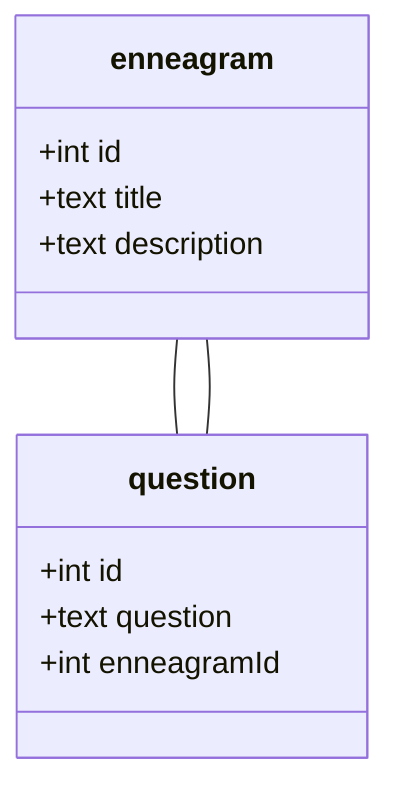

# Enneagram
Bu proje [osmanaykutozalp.com](https://osmanaykutozalp.com/) için geliştirilmiştir. Proje detayları aşağıda belirtilmiştir;

### Hakkında
Proje [osmanaykutozalp.com](https://osmanaykutozalp.com/) sitesine, kullanıcıların kişisel özelliklerini öğrenebileceği bir test uygulaması olarak geliştirilmiştir. Projede bulunan sorular **Osman Aykut Özalp** tarafından yazılmıştır.

### Test Detayları
Test sonuçlarınızı aşağıdaki şekilde hesaplar:
63 sorudan oluşan testte 9 kişilik tip bulunmaktadır. Her kişisel tip için `63/9 = 7` soru bulunmaktadır. Soruların her birinde "kesinlikle katılmıyorum" (0), "katılmıyorum" (1), "nötr" (2), "katılıyorum" (3) ve "kesinlikle katılıyorum" (4) seçenekleri bulunur. Bu seçenekler parantez içinde yazılan puana sahiptir. Eğer kullanıcı x kişisel tipi sorusuna "katılıyorum" seçeneğini işaretlediyse, x tipi için 3 puan almış olur. Test sonunda en yüksek puana sahip olan tip kullanıcının kişilik tipini verir.

### Veritabanı
Projede müşteri isteğine bağlı olarak basit bir tablo ilişkisi kullanılmıştır.

### Teknoloji
Projede **PHP** ve **JavaScript** dilleri, projenin ana yapısını ve mekaniklerini kodlamak için kullanılmıştır. Bunlar:
- Veritabnından sorularını listeleme
- Test cevabını ölçme